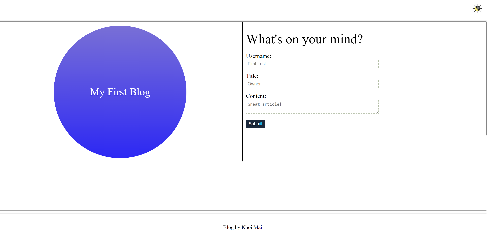

# 04 WebAPI: My Blog
* The URL of the deployed application.
[link to the website](https://thegreatwall88.github.io/My-Blog-/)

* The URL of the GitHub repository, with a unique name and a readme describing the project.
[link to the github website](https://github.com/thegreatwall88/My-Blog-)

The Application to take in username, title and content of the blog then save it to local storage and append it to a blog form website by reading from local storage. dark mode to both web page and ability to go back to blog page from form page.

